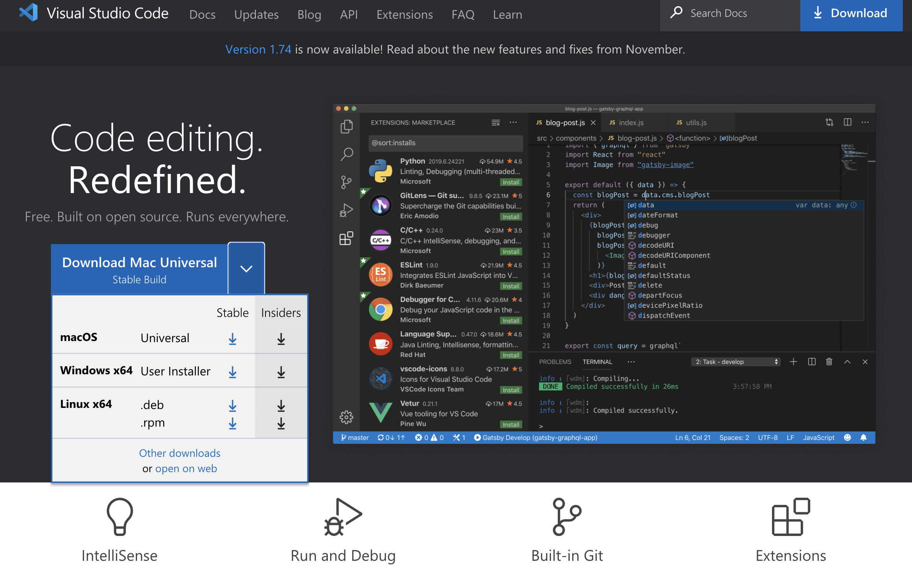
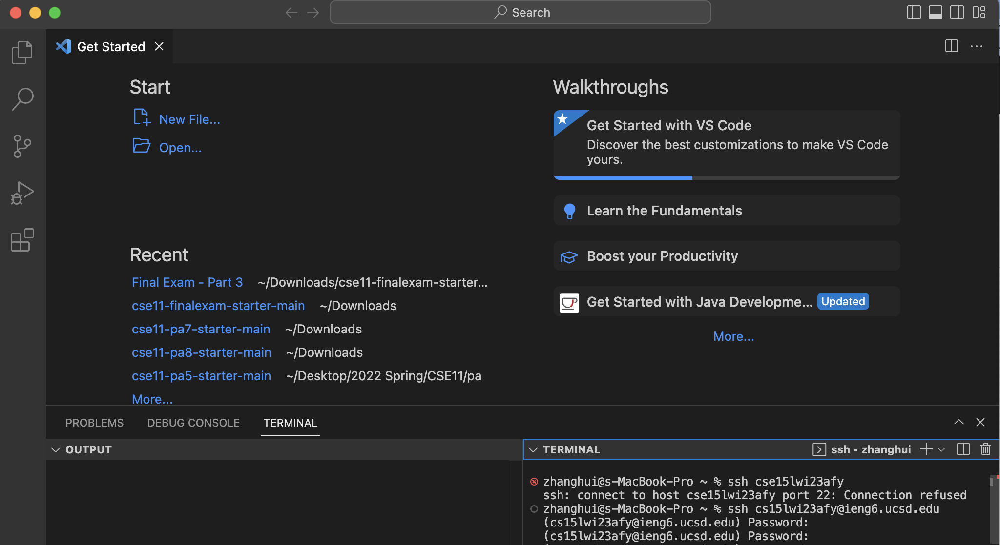
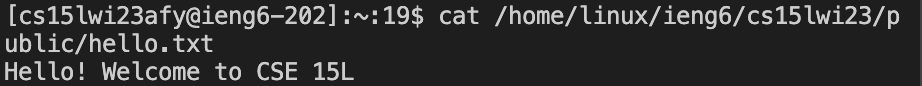
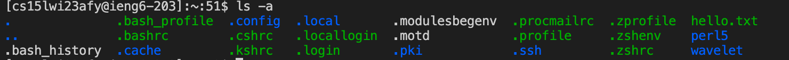
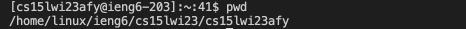

Firstly, log onto the Visual Studio Code website by using [Link](http://code.visualstudio.com).
Depending on the type of the computer, choose the version for MacOS and download. 
Open the zip file after downloading and finish instialling.


Secondly, remotely connect to your account by type in the form ```# code block ssh cs15lwi23zz@ieng6.ucsd.edu```, and replace the the first half with the username of your cse15l student account.
Type in the password. The actual password you type in will be invisible, and hit return key after finish.
If you successfully logged in, there will be notices starting with "hello". Otherwise, you will be required to type in the password. 


Try some commands by typing in a new line ```# code block cat /home/linux/ieng6/cs15lwi23/public/hello.txt```. It can be used to print out the content in the given path. In this case, the code could print out the line showed in the screenshot.


I then tried out the command ```# code block ls -a```. It is used to list contents in the present working directory, including the hidden files. After tying this command, you can see the list of contents in colors below.


Finally, I tried the command ```# code block pwd```. It showed me the working directory I was currectly in, which is the home directory with my username. 
